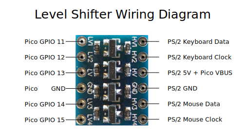
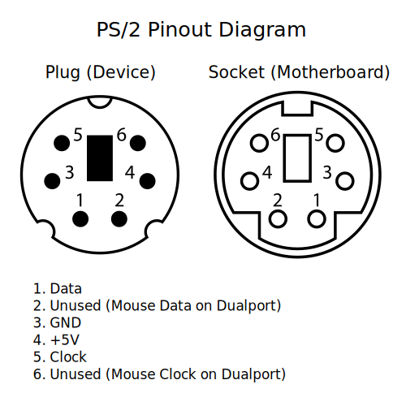

# ps2x2pico
USB keyboard/mouse to PS/2 interface converter using a Raspberry Pi Pico


| | | | |
|-|-|-|-|

Keyboard only (incl. PC-XT) variant: https://github.com/No0ne/ps2pico

[PicoMiteVGA](https://geoffg.net/picomitevga.html) variant: https://github.com/No0ne/hid2cdc

[PiKVM](https://pikvm.org) integration:
* https://docs.pikvm.org/pico_hid/
* https://docs.pikvm.org/pico_hid_bridge/

# Usage
* Download `ps2x2pico.uf2` from https://github.com/No0ne/ps2x2pico/releases
* Copy `ps2x2pico.uf2` to your Pi Pico by pressing BOOTSEL before pluggging in.
* 3.3V/5V conversion is done using a bi-directional level shifter: https://learn.sparkfun.com/tutorials/bi-directional-logic-level-converter-hookup-guide/
* Afterwards connect a USB keyboard and/or mouse using an OTG-adapter and optional USB hub.
* Also works with wireless keyboards and mice with a dedicated USB receiver.


⚠️ Please note that some older motherboards have non-resettable fuses rated
under 300mA.

**Check the power consumption of your keyboard/mouse/hub first before plugging
in!**





⚠️ Do not assume wire colors will match cables depicted in photos. Double-check
your pinout with a multimeter.

# Troubleshooting
You can hook up a USB serial adapter to **GPIO0** for additional debugging output. The serial settings are **115200** baud, **8** data bits and **no parity**. You can also use another Pico running the [pico-uart-bridge](https://github.com/Noltari/pico-uart-bridge) for this.


⚠️ If you have a **YD-RP2040** (see silkscreen on back of board if unsure) and
are not using a USB hub with its own power supply, you need to bridge two pads
of the diode pair near the USB-C port as seen here:


# Build

Get the Raspberry Pi Pico SDK.

```sh
git clone https://github.com/raspberrypi/pico-sdk
```

Install needed libraries and tools.

```sh
sudo apt install cmake gcc-arm-none-eabi build-essential pkg-config libusb-1.0-0-dev libusb-1.0-0
```

(update to the latest TinyUSB release first)
```
export PICO_SDK_PATH=/path/to/pico-sdk
cd $PICO_SDK_PATH/lib/tinyusb
git checkout 0.16.0

cd /path/to/ps2x2pico
mkdir build
cd build
cmake ..
make
```

# Resources
* https://github.com/No0ne/ps2pico
* https://wiki.osdev.org/PS/2_Keyboard
* https://wiki.osdev.org/PS/2_Mouse
* https://wiki.osdev.org/Mouse_Input
* https://wiki.osdev.org/%228042%22_PS/2_Controller
* http://www-ug.eecg.toronto.edu/msl/nios_devices/datasheets/PS2%20Keyboard%20Protocol.htm
* http://www-ug.eecg.utoronto.ca/desl/nios_devices_SoC/datasheets/PS2%20Mouse%20Protocol.htm
* Archive.org links for the dead links in the pages above
  * [Main page PS/2 Keyboard Protocol](https://web.archive.org/web/20160414014033if_/http://www.computer-engineering.org/ps2keyboard/)
    * [Scan code set 1](https://web.archive.org/web/20160410193756if_/http://www.computer-engineering.org/ps2keyboard/scancodes1.html)
    * [Scan code set 2](https://web.archive.org/web/20160414030011if_/http://www.computer-engineering.org/ps2keyboard/scancodes2.html)
    * [Scan code set 3](https://web.archive.org/web/20160410184920if_/http://www.computer-engineering.org/ps2keyboard/scancodes3.html)
  * [Main page PS/2 Mouse Protocol](https://web.archive.org/web/20160414013310if_/http://www.computer-engineering.org/ps2mouse/)
